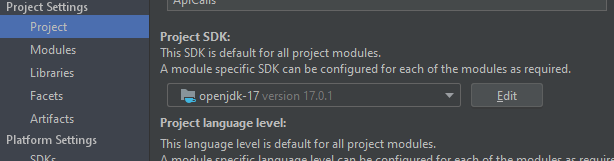
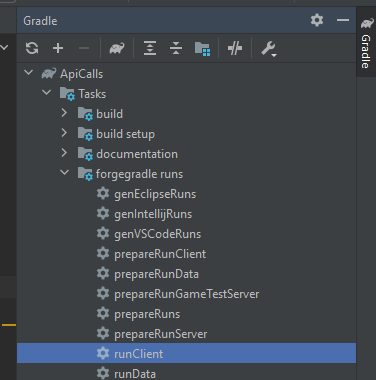

<h1>ApiCalls</h1>

<h2>What It Is</h2>
Minecraft 1.19.2 but it does cool things when you do things ingame

<h2>What It Do (Right Now)</h2>
Makes you feel bad about your self when you type /test in the ingame

<h2>How To Run (With IntelliJ)</h2>
1. Clone Repo
 
2. Open Repo
 
3. Use JDK 17. Change at File/Project Structure
 

 
4. Click This
 
